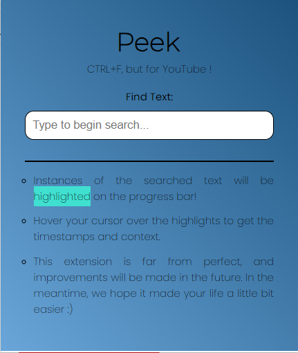
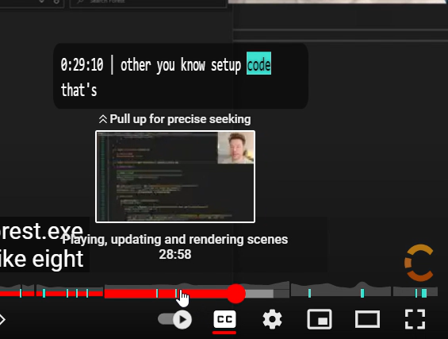

# Peek

## What is Peek?

The CTRL+F command is our go-to whenever we want to search something on a website or in a pdf file. But how does one search in a YouTube video? How do you know how many times a person said "machine learning" in the video, for example. You could look through the transcripts, but that is a tad bit inconvenient! 
Peek is a chrome extension built for just that. Search a word, and it will highlight all instances where the word was spoken on the youtube progress bar. Hover over a highlight and you will see the timestamp and the context around the word (the phrase currently being spoken that this word is a part of).
The version 1.0.0 works, unfortunately, only for videos with a transcript. But we hope to improve this extension so as to not be reliant on that.

## Test it out

* Download the zip file from the latest release and extract it on your machine.
* Fire up your browser and go to chrome://extensions/
* Select "developer mode"
* Click on "load unpacked" and select your extracted folder

## What it looks like

  

video in the screenshot:
https://www.youtube.com/watch?v=1W1FtRaY69Y

## Components:
<ul>
<li>A Manifest.json file that lists out the actions, version number, description, and most importantly resources and action.</li>
<li>Data extraction from the youtube HTML - using javascript</li>
<li>Front end for the extension - using HTML and CSS</li>
<li>Potentially some Python for natural language processing</li>
</ul>

